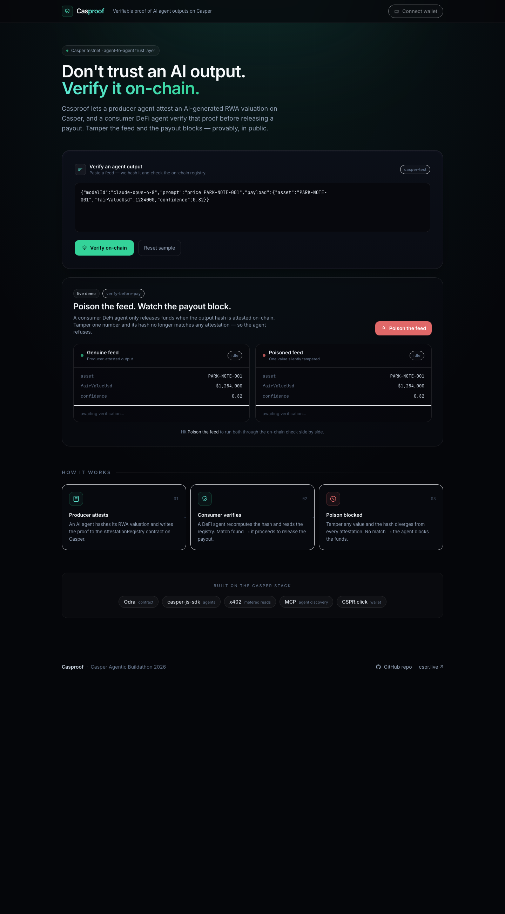
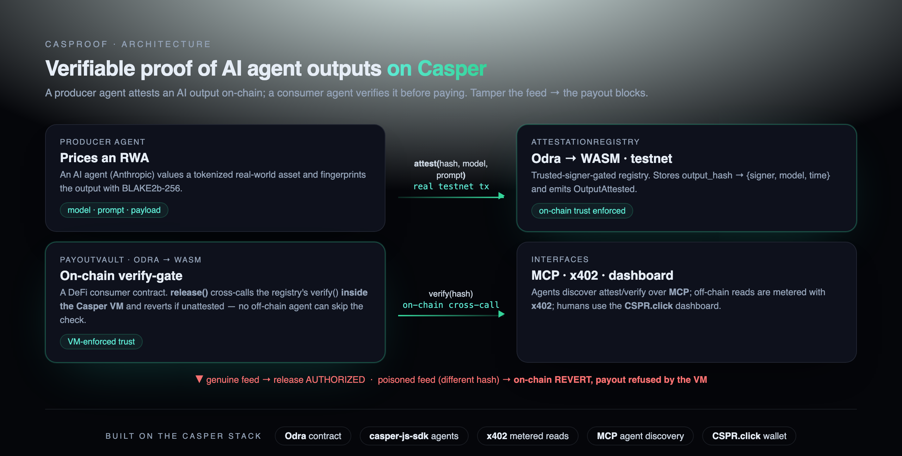

# Casproof

[](https://github.com/SyaugiAlkaf/casproof/actions/workflows/ci.yml)

**Verifiable proof of AI agent outputs on the Casper Network.**

An autonomous agent that produces a result — a price feed, a risk score, an RWA valuation — can publish a cryptographic attestation of that result on-chain: which model produced it, under which prompt, signed by which agent, at which block time. Any other agent can check that attestation before trusting the output and acting on it.

Casproof is the open, agent-economy counterpart to **Prove AI** (formerly Casper Labs). Prove AI attested AI *training data and governance* on-chain; Casproof attests AI *inference outputs* — the piece an agent economy actually trades on — and it does so natively for autonomous agents that discover, pay, attest, and verify on-chain.



## The problem

Casper's thesis is to be the trust layer for the agent economy. But on a chain that sells *verifiable AI*, there is currently no open, on-chain way to verify what an AI agent actually produced. Agents consume each other's outputs — feeds, scores, signals — with no way to know whether an output is the genuine model result or has been swapped, replayed, or tampered with. The first agent that acts on a poisoned feed loses real money.

Casproof closes that gap with a registry contract, two reference agents, an x402-metered verification endpoint, and a dashboard that shows the failure mode live: poison the feed, and the consumer refuses to pay.

## How it works



1. **Producer agent** generates an output (here: an RWA valuation for a tokenized parking-revenue note), hashes the payload deterministically (BLAKE2b-256 over a canonical JSON encoding), and calls `attest(output_hash, model_id, prompt_hash)` on the registry. The attestation is a real on-chain transaction that emits an `OutputAttested` event.
2. **Consumer agent** — a DeFi agent about to release a payout against that feed — recomputes the hash and looks it up in the registry. It releases funds only if the output is attested. A tampered or unattested feed produces a different hash, finds no attestation, and is refused.

The registry **gates `attest()` to trusted signers on-chain** — an untrusted caller reverts — so the mere existence of an attestation proves a trusted signer produced it. Trust is enforced by the contract, not by client configuration.

The consumer reads the attestation **straight from the contract's state in the node** (no indexer, no API key required), by re-deriving the Odra storage key for the registry's `attestations` mapping and querying the dictionary item over RPC. CSPR.cloud's event index is supported as a fallback.

### On-chain enforcement — the verify-gate

An off-chain consumer is convenient, but it's just software that could be patched to skip the check. So Casproof also ships **`PayoutVault`**, a second Casper contract whose `release(output_hash)` **cross-calls the registry's `verify()` inside the VM** and reverts (`NotAttested`) for a tampered or unattested feed. The verify-before-act decision is enforced by the Casper VM — not by any off-chain process. A poisoned feed produces an **on-chain revert** visible on the explorer; no agent can override it. Two interacting contracts, two transaction types, one unfakeable trust guarantee.

### Metered verification (x402)

Verification can be sold per-read. The `/verify` endpoint is paywalled with [x402](https://x402.org): an unpaid request gets `402 Payment Required` with Casper payment requirements (`casper:casper-test`); the client attaches an `X-PAYMENT` header; the request is settled through the hosted Casper facilitator (`x402-facilitator.cspr.cloud`); only then does the endpoint perform the real on-chain read. An oracle operator earns per verified read while agents pay only for what they consume.

The server-side paywall and facilitator settlement are real. The reference client (`payVerify.ts`) constructs the payment payload but does not yet sign it with the Casper x402 scheme (`@casper-ecosystem/casper-eip-712`), so the end-to-end handshake runs in `X402_MODE=sim` out of the box; pointing it at the live facilitator additionally requires the Casper payment signer and a CSPR.cloud key.

### Agent-discoverable (MCP)

Casproof ships an [MCP](https://modelcontextprotocol.io) server so any AI agent — Claude Desktop, an autonomous agent, anything that speaks the Model Context Protocol — can discover and call it directly. Three tools:

- `casproof_compute_hash` — fingerprint an output (no chain access)
- `casproof_verify` — check an output on-chain and get back a `PROCEED` / `BLOCK` decision
- `casproof_attest` — publish an attestation on-chain (real testnet transaction)

This is exactly the pattern Casper's AI toolkit is built around — *agents discover capabilities via MCP, pay via x402, settle on-chain* — and it makes Casproof both a **consumer** of agentic infrastructure (it attests *its own* AI outputs) and a **provider** of it (other agents call it to verify-before-act).

## Components

| Path | What it is |
|---|---|
| `contract/` | Two [Odra](https://odra.dev) (Rust → WASM) contracts: `AttestationRegistry` (trusted-signer-gated `attest`, `verify`, allow-list, on-chain `reputation`) and **`PayoutVault`** — a DeFi consumer that cross-calls `verify()` on-chain and reverts unless the output is attested. |
| `agents/` | TypeScript producer + consumer agents, the on-chain read library, the x402 verify server, the **MCP server**, and the keygen/deploy/resolve scripts (`casper-js-sdk` v5, Anthropic API). |
| `ui/` | Next.js dashboard (CSPR.click wallet connect) — verify an output, show the attestation badge + explorer link, and the live poison→block contrast screen. |

**Casproof in the Casper stack:** Odra (contract) · casper-js-sdk v5 (agents) · x402 facilitator (metered reads) · MCP (agent discovery) · CSPR.click (dashboard wallet) — four of Casper's flagship AI-toolkit components, composed into one verifiable-inference primitive.

## Quick start

### Prerequisites
- Rust + the [cargo-odra](https://github.com/odradev/cargo-odra) CLI (`cargo install cargo-odra`). The contract pins `nightly-2026-01-01` via `contract/rust-toolchain.toml`; `wasm-opt`/`wasm-strip` (binaryen + wabt) are used to shrink the wasm.
- Node 20+.
- A funded Casper **testnet** key ([faucet](https://testnet.cspr.live/tools/faucet)). The faucet funds a key once — use a fresh keypair.

### Contract
```bash
cd contract
make test                # OdraVM unit tests  (= cargo odra test)
make build               # build + wasm-opt -Oz → wasm/AttestationRegistry.wasm (~192 KB)
```
`make build` runs `cargo odra build` then shrinks the wasm with `wasm-opt -Oz` to lower install gas; plain `cargo odra build` works too.

### Agents
```bash
cd agents
npm install
cp ../.env.example ../.env       # fill in keys + RPC + (after deploy) the contract hash

npm run keygen                   # generate a fresh ed25519 key → keys/producer_secret_key.pem
#   → fund the printed public key once at https://testnet.cspr.live/tools/faucet

npm run deploy                   # install the registry on testnet (uses PRODUCER_KEY_PATH)
npm run resolve                  # print REGISTRY_CONTRACT_HASH + REGISTRY_PACKAGE_HASH
#   → paste both into .env

npm run deploy:vault             # install PayoutVault wired to the registry (needs REGISTRY_PACKAGE_HASH)
npm run resolve:vault            # print VAULT_CONTRACT_HASH → paste into .env

npm run producer                 # produce an RWA valuation + attest it on-chain (prints tx + explorer link)
npm run demo                     # genuine → PAY, poisoned → BLOCK, plus the on-chain vault gate (authorize vs revert)
npm test                         # unit tests (+ a deploy-gated integration test)
```

### Metered verification (x402)
```bash
cd agents
npm run x402:server              # GET /verify?hash=<outputHash>, paywalled with x402
npm run x402:verify <outputHash> # client: handles 402 → pay → retry, prints the verified result
```

### MCP server
```bash
cd agents
npm run mcp                      # stdio MCP server exposing compute_hash / verify / attest
```
Plug it into any MCP client — see `agents/mcp.example.json` for a Claude Desktop config. Once connected, an assistant can verify an RWA output in natural language ("is this valuation attested on Casper?").

### Dashboard
```bash
cd ui
npm install --legacy-peer-deps   # CSPR.click pins React 18 peers
cp .env.example .env.local       # CASPER_CHAIN_RPC + REGISTRY_CONTRACT_HASH
npm run dev                      # http://localhost:3000
```

## Why Casper

- **Real-world assets & DeFi.** The reference flow is an RWA valuation gating a DeFi payout — the regulated, value-bearing machine-to-machine use case Casper targets, and aligned with the Casper Manifest's focus on compliant (ERC-3643-style) tokenized assets.
- **Agent-native.** Producer and consumer are autonomous agents; they *discover* Casproof over MCP, *pay* for verification over x402, and *settle* on-chain — the exact agent loop Casper's AI toolkit is designed for.
- **Honest on-chain.** Every attestation is a real testnet transaction; verification reads real contract state; trust is enforced by the contract. Nothing is mocked in the trust path.

## Design notes

- Output hashing is canonical (keys sorted) so the same payload always hashes identically regardless of serialization. The prompt is hashed separately so a verifier can confirm *what was asked* without the registry storing prompt text.
- `attest()` reverts for non-trusted callers, so an on-chain attestation is itself proof of a trusted signer; the contract also rejects duplicates and gates the signer allow-list behind an owner check.
- All chain calls live in one module (`agents/src/casper.ts`); the storage-key derivation that lets the consumer read the registry without an indexer is unit-tested against a fixed vector.

## Launch plan

1. **Audit + mainnet.** Harden and audit `AttestationRegistry`, deploy to Casper mainnet, and run the x402 verify endpoint as a sponsored public good during onboarding.
2. **Oracle SDK.** Publish a small SDK (`attest`/`verify` in two calls) plus the MCP server so any RWA data provider can become a trusted signer and any DeFi agent can verify-before-act.
3. **Metered attestation as revenue.** The x402 paywall lets signer-operators charge per verified read — a self-sustaining business model for running an attestation oracle.
4. **Compliance fit.** Map the trusted-signer set to ERC-3643-style permissioned issuers so attestations slot into regulated tokenized-asset workflows.

## Long-term impact

Casper wants to be the trust layer for the agent economy. As agents increasingly transact on each other's outputs, "is this output the genuine model result, from a source I trust?" becomes a settlement-critical question. Casproof makes that a one-call, on-chain primitive — and by exposing it over MCP and metering it with x402, it becomes infrastructure other Casper agents build on rather than a single app. The registry already tracks portable signer **reputation** (attestation count per signer) on-chain; natural extensions: reputation-weighted trust, attestation of reasoning traces (not just final outputs), multi-signer quorums for high-value feeds, and attestation expiry for time-sensitive valuations.

## License

Apache-2.0
